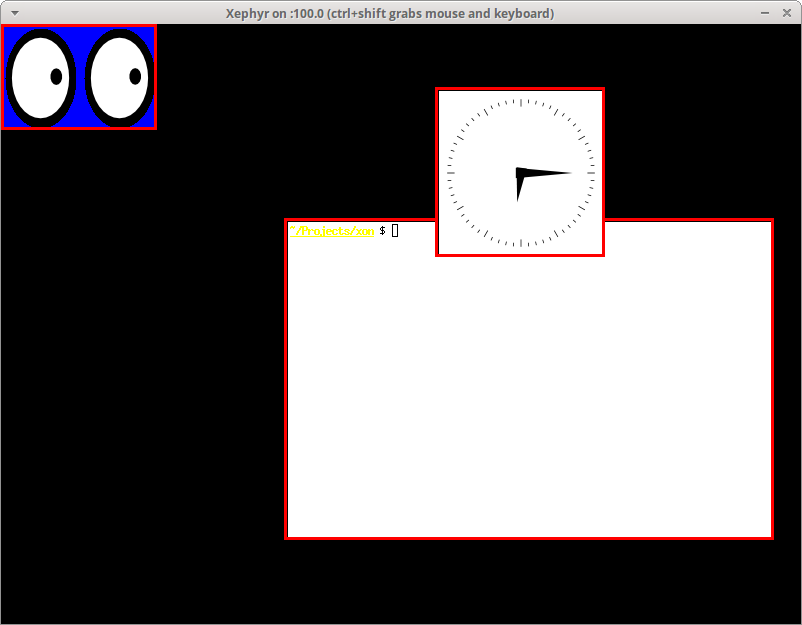

# Basic Window Manager

[![Build Status][build-status-image]][github-url]

basic_wm is a simple reparenting, non-compositing X window manager that demonstrates
how to implement the fundamental functionality of a window manager:

- Managing the life cycle of windows
- Reparenting windows
- Basic window operations (moving, resizing, closing)

It serves as a pedagogical example for my series of articles,
[_How X Window Managers Work, And How To Write One_](https://jichu4n.com/posts/how-x-window-managers-work-and-how-to-write-one-part-i/).

## Building and Running

To build this example window manager, you will need:

- A C++-11 enabled C++ compiler
- [GNU Make](https://www.gnu.org/software/make/)
- Xlib headers and libraries
- [google-glog](https://code.google.com/p/google-glog/) library

To run and test it, you will need:

- [Xephyr](http://www.freedesktop.org/wiki/Software/Xephyr/)
- `xinit`
- Random X utilities such as `xclock`, `xeyes`, and `xterm` to play with

On Debian / Ubuntu:

    sudo apt-get install \
        build-essential pkg-config libx11-dev libgoogle-glog-dev \
        xserver-xephyr xinit x11-apps xterm

On Fedora:

    sudo yum install \
        make gcc gcc-c++ libX11-devel glog-devel \
        xorg-x11-server-Xephyr xorg-x11-apps xterm

On Arch Linux:

    sudo pacman -S base-devel libx11 google-glog \
        xorg-server-xephyr xorg-xinit xorg-xclock xorg-xeyes xterm

Once you have all the dependencies, building and running it is as simple as:

    ./build_and_run.sh

This will launch a simple Xephyr session like in the following screenshot:

## Usage

Supported keyboard shortcuts:

- **Alt + Left Click**: Move window
- **Alt + Right Click**: Resize window
- **Alt + F4**: Close window
- **Alt + Tab**: Switch window

[github-url]: https://github.com/jichu4n/basic_wm
[build-status-image]: https://github.com/jichu4n/basic_wm/actions/workflows/build.yaml/badge.svg
